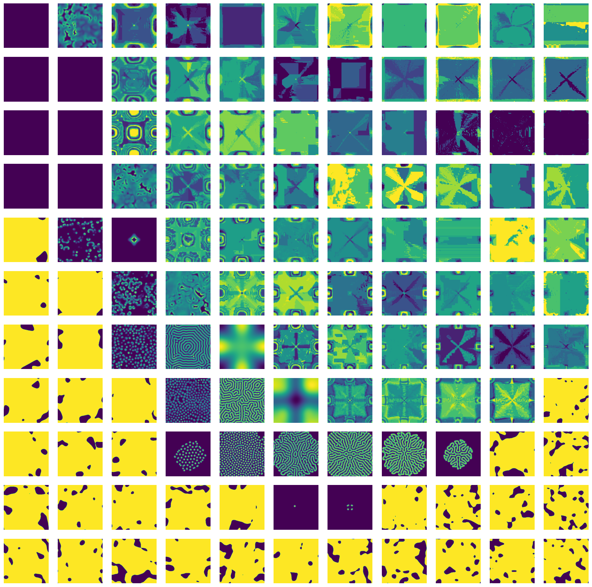

# Reaction Diffusion systems
This is a demo that shows how to do a parameter scan using Snakemake. We're reproducing results from a paper by [Pearson 1993 (arXiv link)](https://arxiv.org/pdf/patt-sol/9304003.pdf) in Science.

<iframe width="560" height="315" src="https://www.youtube.com/embed/LL3kVtc-4vY?start=473" title="YouTube video player" frameborder="0" allow="accelerometer; autoplay; clipboard-write; encrypted-media; gyroscope; picture-in-picture" allowfullscreen></iframe>
