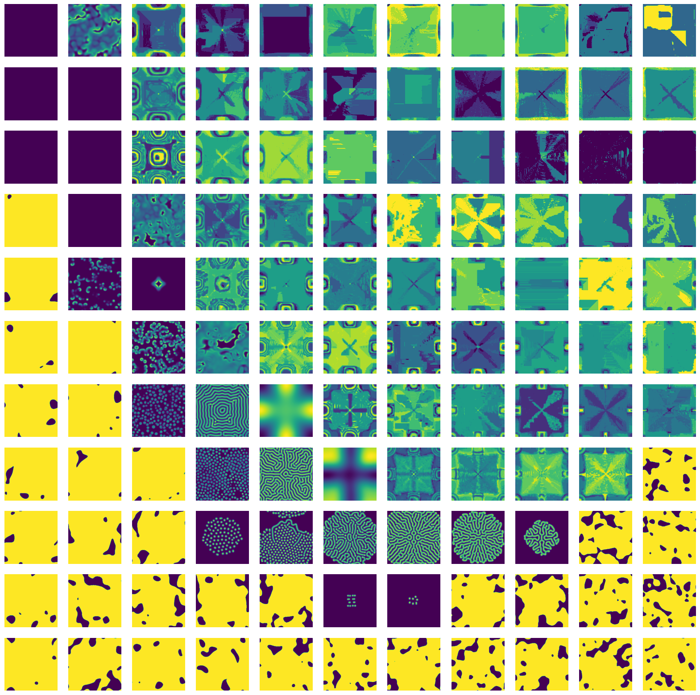

About
=====
This is a demo that shows how to do a parameter scan using Snakemake. We're reproducing results from a paper by [Pearson 1993 (arXiv link)](https://arxiv.org/pdf/patt-sol/9304003.pdf) in Science. The goal is to create a figure similar to this:

{width="100%"}

Scientific Background
=====================
The core of these ideas date back to Alan Turing himself. In his [last paper in 1952](https://www.dna.caltech.edu/courses/cs191/paperscs191/turing.pdf) he wrote about the possible origin of pattern formation in chemistry and biology.

Reaction-diffusion systems are not just a theory. With some effort you can create these reactions for real:

<iframe width="560" height="315" src="https://www.youtube.com/embed/LL3kVtc-4vY?start=473" title="YouTube video player" frameborder="0" allow="accelerometer; autoplay; clipboard-write; encrypted-media; gyroscope; picture-in-picture" allowfullscreen></iframe>

We see patterns in nature all around us. Some of these patterns can be explained by models that are very similar to the Gray-Scott model that we look at here. For example, in arid climates the combination of limited precipitation and animal grazing results in varying patterns of vegetation (see for instance the [work by Max Rietkerk](https://citeseerx.ist.psu.edu/viewdoc/download?doi=10.1.1.505.4299&rep=rep1&type=pdf) and collaborators).

The Model
=========
This demo needs the following imports:

``` {.python file=Snakefile}
import numpy as np
import h5py as h5
from numba import njit

<<laplacian>>
<<gray-scott-model>>
<<euler-method>>
<<initial-state>>
<<run-model>>
<<parameter-space>>

# Not shown here
<<a-solution>>
```

The paper computes a system by Gray and Scott (1985). The idea is that we have a two-dimensional space with two substances, $U$ and $V$. The substance $V$ is a promotor to turn $U$ into more $V$, and a second reaction slowly turns $V$ into an inert waste product $P$:

$$\begin{align}
U + 2V &\to 3V \\ V &\to P.
\end{align}$$

We have a constant feed of more $U$ onto the system by a feed rate $F$. This means that $U$ is self-inhibiting, while $V$ has a positive feedback.
Meanwhile, both substances are diffusing at different rates. The combination of an inhibitor and a promotor diffusing at different rates gives rise to so-called Turing patterns, after a 1952 paper by Alan Turing.

The equations given by Pearson 1993 for the Gray-Scott model are as follows:

$$\begin{align}
\frac{\partial U}{\partial t} &= D_u \nabla^2 U - UV^2 + F(1 - U)\\
\frac{\partial V}{\partial t} &= D_v \nabla^2 V + UV^2 - (F + k)V.
\end{align}$$

In Python these translate to:

``` {.python #gray-scott-model}
def gray_scott_model(F, k, D_u=2e-5, D_v=1e-5, res=0.01):
    def df(state: np.ndarray, _: float) -> np.ndarray:
        U, V = state
        du = D_u*laplacian(U)/res**2 - U*V**2 + F*(1 - U)
        dv = D_v*laplacian(V)/res**2 + U*V**2 - (F + k)*V
        return np.stack((du, dv))
    return df
```

The `gray_scott_model` function takes the parameters of the model, returning an ordinary differential equation of the form $y' = f(y, t)$. The paper states some choices for the diffusion rates, as well as setting the physical size of the setup to $2.5 \times 2.5$ length units. Since we are computing on a $256 \times 256$ pixel grid, we set the resolution to 0.01, which is used to scale the gradient computation. To compute the Laplacian we have to write a custom function, doing a stencil operation:

``` {.python #laplacian}
@njit
def laplacian(x: np.array):
    m, n = x.shape
    y = np.zeros_like(x)
    for i in range(m):
        for j in range(n):
            y[i,j] = x[(i-1)%m,j] + x[i,(j-1)%n] \
                   + x[(i+1)%m,j] + x[i,(j+1)%n] - 4*x[i,j]
    return y
```

Pearson describes the initial conditions as starting out $U=1$, $V=0$ everywhere except a group of cells in the center of the box, where $U=1/2$ and $V=1/4$. To break symmetry, a small amount of Gaussian noise is added.

``` {.python #initial-state}
def initial_state(shape) -> np.ndarray:
    U = np.ones(shape, dtype=np.float32)
    V = np.zeros(shape, dtype=np.float32)

    centre = (slice(shape[0]//2-10, shape[0]//2+10),
              slice(shape[1]//2-10, shape[1]//2+10))
    U[centre] = 1/2
    V[centre] = 1/4

    U += np.random.normal(0.0, 0.01, size=shape)
    V += np.random.normal(0.0, 0.01, size=shape)

    return np.stack((U, V))
```

We can integrate this ODE using the Euler method, note the creative use of the wallrus operator to write the solver in terms of generator comprehensions:

``` {.python #euler-method}
def euler_method(df, y_init, t_init, t_end, t_step):
    n_steps = int((t_end - t_init) / t_step)
    y = y_init
    times = (t_init + i*t_step for i in range(n_steps))
    return (y := y + df(y, t)*t_step for t in times)
```

Now comes the fun part: Pearson proposes to integrate the model for 200,000 time steps! Actually 10,000-20,000 is already enough to see some nice patterns appear. This takes quite a while to compute, even on a modern computer. The `run_model` function computes the Gray-Scott model for several iterations, and stores a selection of time steps into an array.

``` {.python #run-model}
def run_model(k, F, t_end=10_000, write_interval=20, shape=(256, 256)):
    n_snaps = t_end // write_interval
    result = np.zeros(shape=[n_snaps, 2, shape[0], shape[1]],
                      dtype=np.float32)

    rd = gray_scott_model(k=k, F=F)
    init = initial_state(shape=shape)
    comp = euler_method(rd, init, 0, t_end, 1)
    for i, snap in enumerate(comp):
        if i % write_interval == 0:
            result[i // write_interval] = snap

    return result
```

Exercise
========
Write a parameter scan in Snakemake. Let $k$ vary between 0.03 and 0.07, and $F$ between 0.0 and 0.08. These computations are quite expensive, so don't make the scan too dense:

``` {.python #parameter-space}
k_values = np.linspace(0.03, 0.07, 11)
F_values = np.linspace(0.00, 0.08, 11)
```

You need to run `run_model` for every combination of $k$ and $F$, in the example above this would give you 121 models to run. There are two kinds of visualisations that you could make: one is an overview of model outputs like shown at the top, the other would be to make a small movie of a single one of these model runs.

#### hint 0: how does it scale?
How much RAM would you need to fit the entire parameter scan in memory, supposing you scan the parameters on a 11x11 grid? If your computer is not too fast, try lowering the number of pixels and time frames per model run.

#### hint 1: use HDF5 files
You need to store each output of `run_model`, preferably in an HDF5 file, so that you can add attributes, and use your results for later analysis. For example, for a single run you may write your output to an HDF5 file like so:

``` {.python}
k = 0.048
F = 0.020
result = run_model(k, F)
with h5.File("k0048-F0020.h5", "w") as f_out:
    f_out.attrs["k"] = k
    f_out.attrs["F"] = F
    f_out["U"] = result[:, 0]
    f_out["V"] = result[:, 1]
```

For more information, check out the [HDF5 Python documentation](https://docs.h5py.org/en/stable/).

#### hint 2: if you're using Snakemake
Familiarize yourself with [**wildcards** in Snakemake](https://snakemake.readthedocs.io/en/stable/snakefiles/rules.html#wildcards), as well as the [`expand` function](https://snakemake.readthedocs.io/en/stable/snakefiles/rules.html#the-expand-function).

#### hint 3: don't trust floating points
Create some arrays that contain the parameters you want to scan, then store the index to these arrays in the HDF5 file. This way you can always find back which part of the parameter scan is in which file.

## If you have time left
The Euler method is extremely inefficient for diffusion systems. However, implicit methods cannot handle the reaction part of the equations very well. You may want to check out this paper by [Chou et al. 2007](https://www.math.uci.edu/~qnie/Publications/ja29.pdf).

``` {.python #a-solution .hide}
rule map_vis:
    input:
        expand("data/k{param_k}-F{param_F}.h5",
               param_k=[f"{k:02}" for k in range(len(k_values))],
               param_F=[f"{F:02}" for F in range(len(F_values))])
    output:
        "fig/pattern_map.png"
    run:
        from matplotlib import pyplot as plt
        fig, ax = plt.subplots(len(k_values), len(F_values), figsize=(20, 20))
        for fname in input:
            with h5.File(fname, "r") as f_in:
                i = f_in.attrs["k_index"]
                j = f_in.attrs["F_index"]
                ax[i,j].imshow(f_in["V"][-1])
                ax[i,j].set_axis_off()
        # fig.tight_layout()
        fig.savefig(output[0], bbox_inches="tight")


rule compute_model:
    output:
        "data/k{param_k}-F{param_F}.h5"
    run:
        k = k_values[int(wildcards.param_k)]
        F = F_values[int(wildcards.param_F)]
        result = run_model(k, F)
        with h5.File(f"{output[0]}", "w") as f_out:
            f_out.attrs["k"] = k
            f_out.attrs["F"] = F
            f_out.attrs["k_index"] = int(wildcards.param_k)
            f_out.attrs["F_index"] = int(wildcards.param_F)
            f_out["U"] = result[:, 0]
            f_out["V"] = result[:, 1]
```
